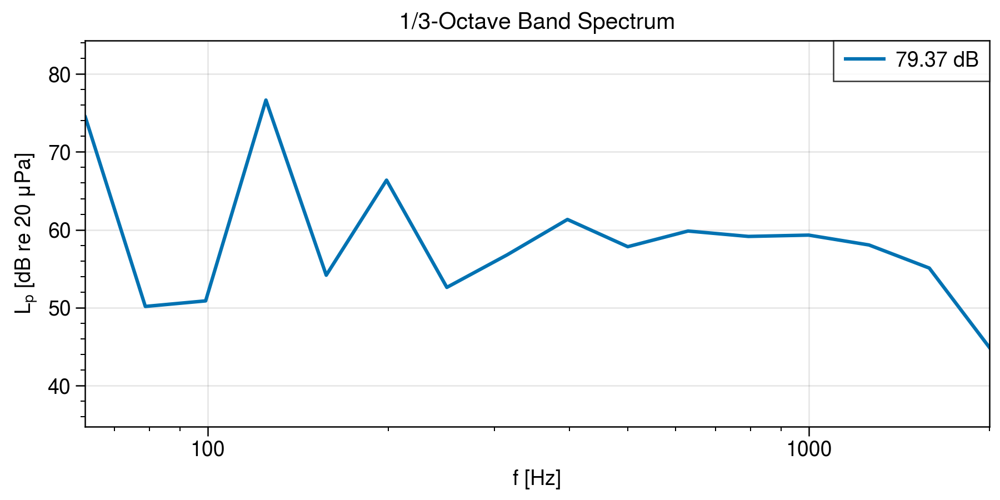
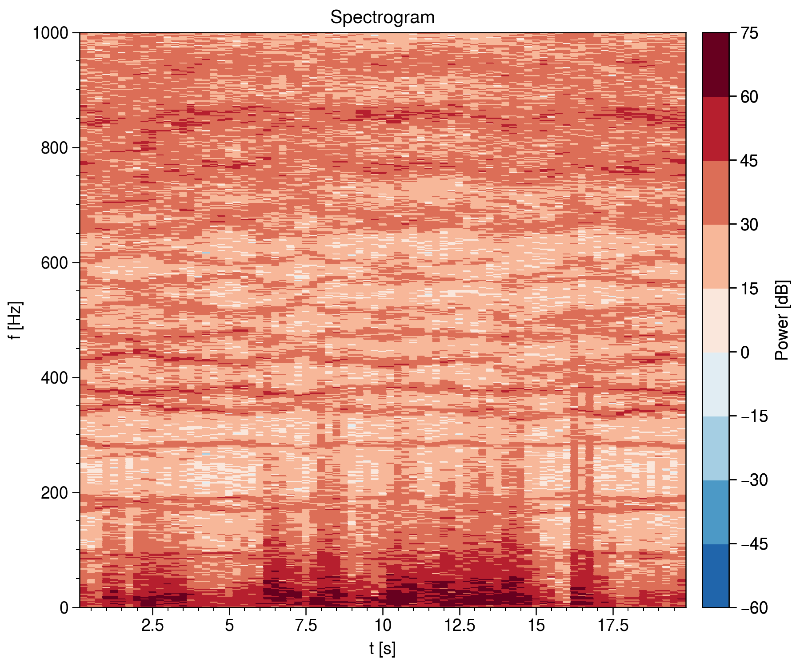

# `AcousticAnalysis`

</img>
</img>
</img>

## Installation

Conda environment with the following packages:

```bash
pip install git+https://github.com/endolith/waveform_analysis.git@master
pip install proplot
```
