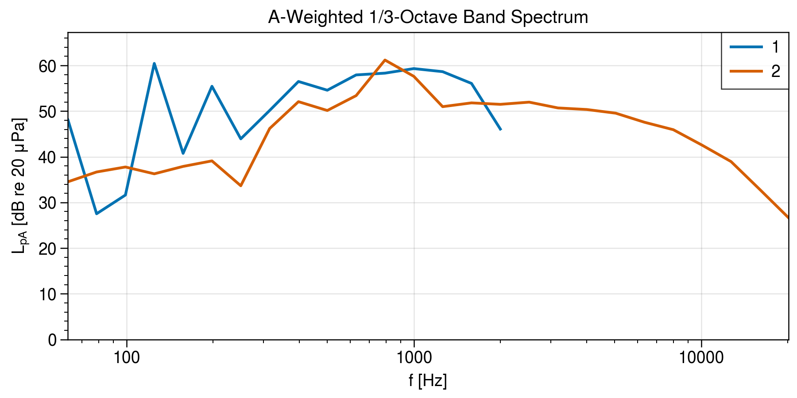
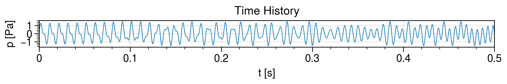
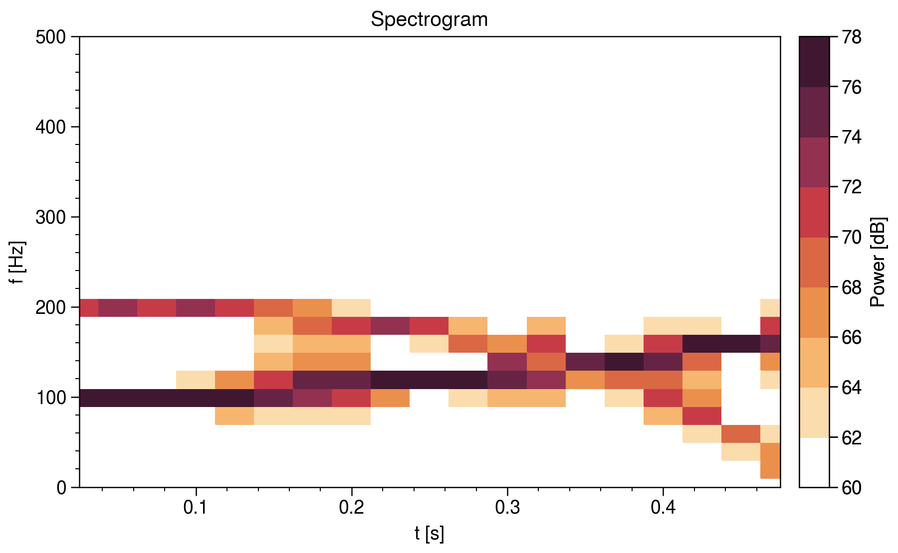
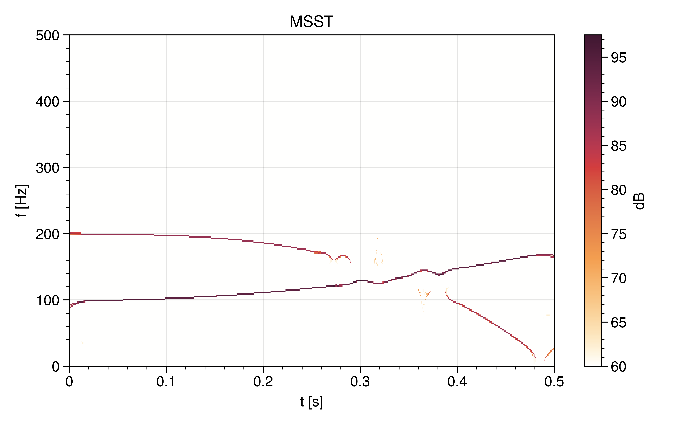

# AcousticAnalysis.jl

## Features

### Spectrum, Spectrogram

</img>
</img>
</img>

### Multisynchrosqueezing Transform

</img>
</img>
</img>

## Installation

Conda environment with the following packages:

```bash
pip install git+https://github.com/endolith/waveform_analysis.git@master
pip install proplot
```

## References

1. G. Yu, Z. Wang, and P. Zhao, “Multisynchrosqueezing Transform,” IEEE Transactions on Industrial Electronics, vol. 66, pp. 5441–5455, Jul. 2019, doi: 10.1109/TIE.2018.2868296.

## Acknowledgements

Inspired by this MATLAB code: <https://ch.mathworks.com/matlabcentral/fileexchange/68571-multisynchrosqueezing-transform>

## License

This code is licensed under MIT.
